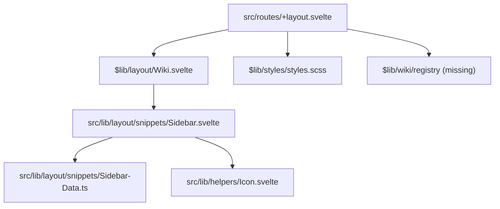
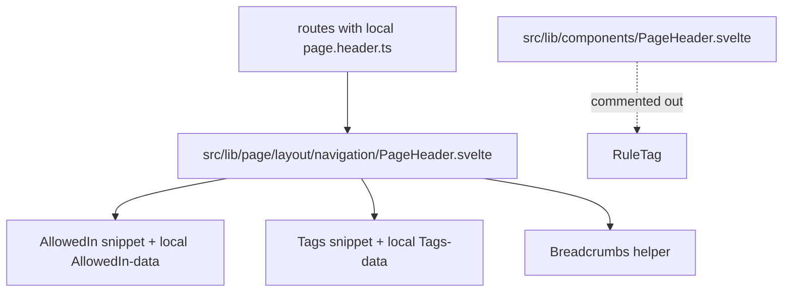
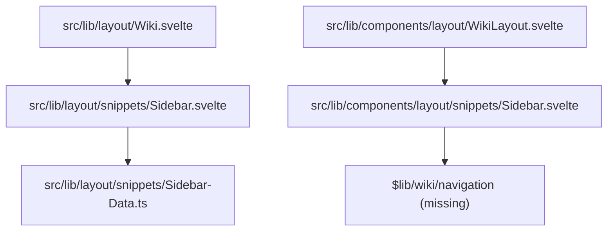
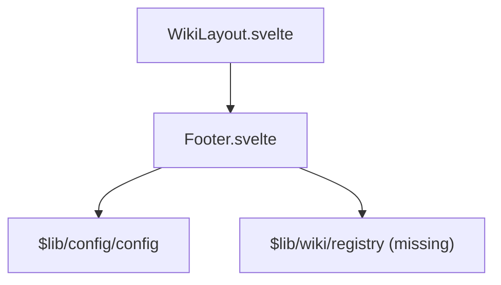
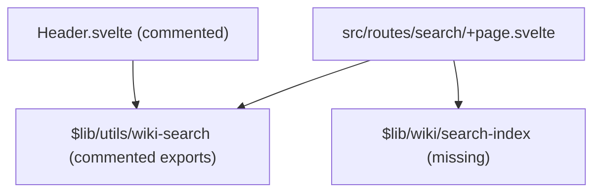
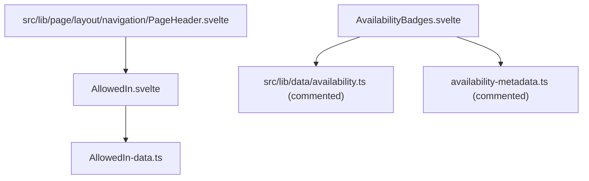
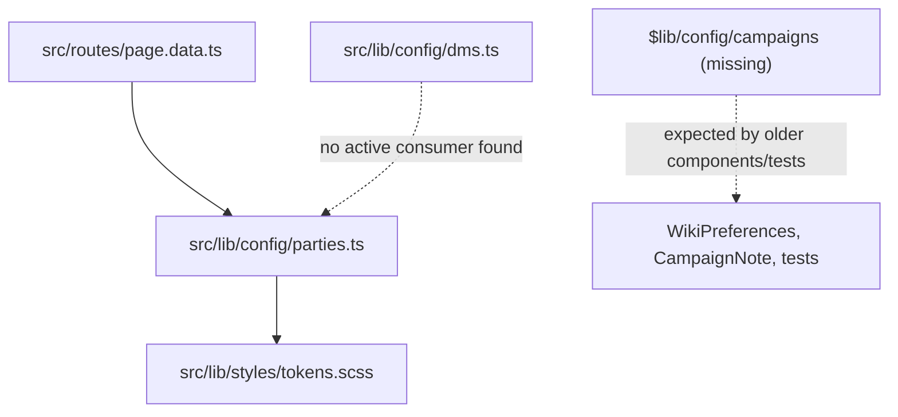
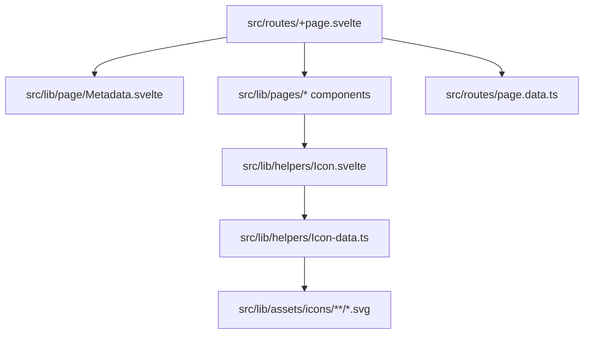

# Dependency Map

## Root Layout

## Page Header

## Sidebar Navigation

## Footer

## Search

## Availability

## Party/Campaign

## Metadata/Homepage/Icon

## Violations

- Generic/legacy layout components import deleted domain registries (`$lib/wiki/navigation`, `$lib/wiki/registry`).
- New homepage data imports deleted `$lib/wiki/registry`, mixing new page components with removed old registry contracts.
- Route-local metadata duplicates site identity and social metadata instead of deriving from config.
- New sidebar owns navigation labels/URLs separately from any registry source of truth.
- Party config and DM config are separated but `parties.ts` stores `dmId` values `toon`/`tijs`, while `dms.ts` keys are `i1`/`i2`.
- Root-absolute asset paths appear in active layout code despite GitHub Pages base-path requirements.
