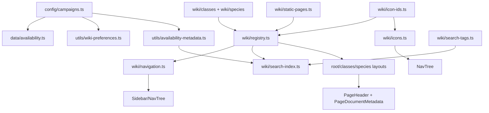
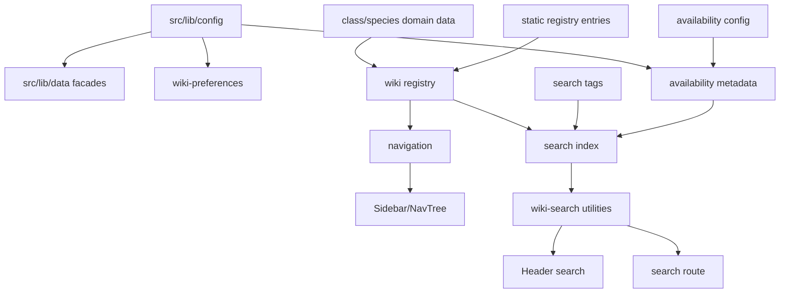
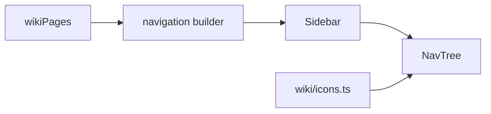
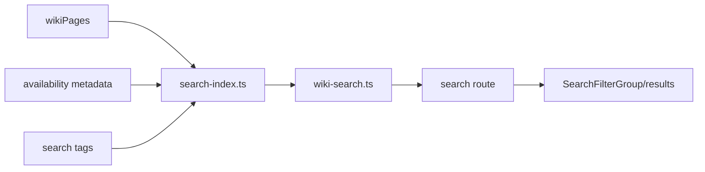
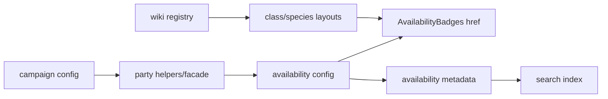
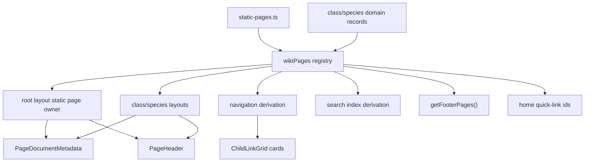
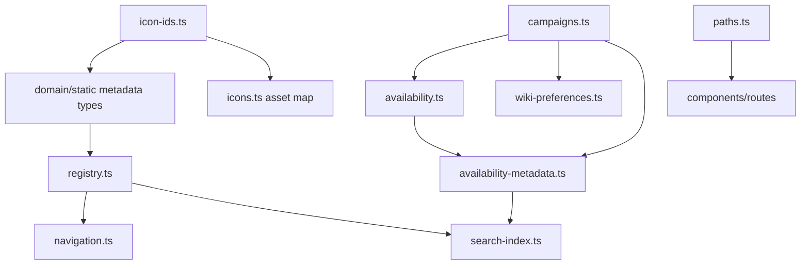
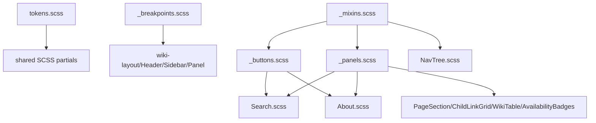

# Dependency Map

## Current State After Phase 7

The current core dependency direction is:

Validated constraints:

- No runtime cycles in the core Wiki/config/data modules.
- Config modules do not import components.
- Domain metadata modules do not import registry-derived modules.
- Registry does not import navigation or search.
- Availability does not import UI.
- `icon-ids.ts` does not import SVG assets; `icons.ts` owns asset imports.
- Route pages are body/content consumers, not authoritative data modules.

## Historical Snapshot

The file-level import map below is the original audit snapshot. Phase result sections supersede rows for removed files or later import-direction changes.

## File-Level Import Map

| File | Imports | Exports |
| --- | --- | --- |
| .vscode/extensions.json | - | - |
| package-lock.json | - | - |
| package.json | - | - |
| scripts/test-wiki-search.mjs | node:assert/strict, node:fs, node:path, node:test | - |
| scripts/verify-pages-build.mjs | node:fs, node:path, node:url | - |
| src/app.d.ts | - | - |
| src/lib/components/AvailabilityBadges.scss | - | - |
| src/lib/components/AvailabilityBadges.svelte | $lib/data/availability, $lib/utils/availability-metadata, ./AvailabilityBadges.scss | - |
| src/lib/components/CampaignNote.scss | - | - |
| src/lib/components/CampaignNote.svelte | svelte, ./CampaignNote.scss | - |
| src/lib/components/ChildLinkGrid.scss | - | - |
| src/lib/components/ChildLinkGrid.svelte | svelte, $lib/utils/paths, ./ChildLinkGrid.scss | - |
| src/lib/components/feedback/EmptyState.svelte | svelte, $lib/styles/panels | - |
| src/lib/components/forms/ActionButton.svelte | svelte, $lib/styles/buttons | - |
| src/lib/components/forms/SelectField.svelte | $lib/styles/forms | - |
| src/lib/components/layout/Panel.svelte | svelte, $lib/styles/panels | - |
| src/lib/components/layout/snippets/Footer.scss | - | - |
| src/lib/components/layout/snippets/Footer.svelte | $lib/components/WikiImage.svelte, $lib/config/site, $lib/utils/paths, ./Footer.scss | - |
| src/lib/components/layout/snippets/Header.scss | - | - |
| src/lib/components/layout/snippets/Header.svelte | $app/navigation, $app/state, $lib/utils/paths, $lib/utils/wiki-search, $lib/wiki/search-index, ./Header.scss | - |
| src/lib/components/layout/snippets/helpers/NavTree.scss | - | - |
| src/lib/components/layout/snippets/helpers/NavTree.svelte | $lib/wiki/navigation, $lib/wiki/icons, $lib/utils/paths, ./NavTree.svelte, ./NavTree.scss | - |
| src/lib/components/layout/snippets/Sidebar.scss | - | - |
| src/lib/components/layout/snippets/Sidebar.svelte | $app/state, $lib/config/campaigns, $lib/wiki/navigation, $lib/utils/paths, ./helpers/NavTree.svelte, ./Sidebar.scss | - |
| src/lib/components/layout/WikiLayout.svelte | svelte, ./snippets/Header.svelte, ./snippets/Sidebar.svelte, ./snippets/Footer.svelte | - |
| src/lib/components/PageHeader.scss | - | - |
| src/lib/components/PageHeader.svelte | ./RuleTag.svelte, ./PageHeader.scss | - |
| src/lib/components/PageSection.scss | - | - |
| src/lib/components/PageSection.svelte | svelte, ./PageSection.scss | - |
| src/lib/components/RuleTag.scss | - | - |
| src/lib/components/RuleTag.svelte | ./RuleTag.scss | - |
| src/lib/components/search/SearchFilterGroup.svelte | svelte, $lib/styles/mixins, $lib/styles/panels | SearchFilterOption |
| src/lib/components/WikiImage.svelte | svelte/elements, $lib/utils/paths | - |
| src/lib/components/WikiPreferences.scss | - | - |
| src/lib/components/WikiPreferences.svelte | svelte, $lib/components/forms/ActionButton.svelte, $lib/components/forms/SelectField.svelte, $lib/components/layout/Panel.svelte, $lib/config/campaigns, $lib/utils/wiki-preferences, ./WikiPreferences.scss | - |
| src/lib/components/WikiTable.scss | - | - |
| src/lib/components/WikiTable.svelte | ./WikiTable.scss | - |
| src/lib/config/campaigns.ts | - | campaignConfig, DungeonMasterId, PartyId, DungeonMaster, Party, dungeonMasters, parties, dungeonMasterById, partyById, getDungeonMaster, getParty, getPartiesForDungeonMaster, getDungeonMasterForParty, isDungeonMasterId, isPartyId, validateCampaignConfig |
| src/lib/config/site.ts | - | siteConfig |
| src/lib/data/ai-images.ts | - | AiImageType, AiImageEntry, aiGeneratedImages, aiEditedImages, aiImages |
| src/lib/data/availability.ts | ./parties.js | PageAvailability, AvailabilityNode, AvailabilityBranch, AvailabilityConfig, availability, getAvailabilityByHref |
| src/lib/data/changelog.ts | - | ChangeType, ChangeLink, ChangeItem, ChangelogRelease, changeTypeLabels, changelog |
| src/lib/data/classes.ts | - | classes, ClassCode, ClassData, selectClass |
| src/lib/data/dungeon-masters.ts | - | dungeonMasterById, dungeonMasters, getDungeonMaster, DungeonMaster, DungeonMasterId |
| src/lib/data/parties.ts | ../config/campaigns.js | parties, PartyCode, Party, PartyOption, selectParties, getPartyIdByName, getParty, isPartyId, partyOptions |
| src/lib/data/sources.ts | - | SourceKind, SourceStatus, SourceAccess, SourceLink, SourceEntry, sourceKindLabels, sourceStatusLabels, sourceAccessLabels, sources |
| src/lib/index.ts | - | - |
| src/lib/styles/global.scss | tokens | - |
| src/lib/styles/tokens.scss | - | - |
| src/lib/styles/wiki-layout.scss | - | - |
| src/lib/styles/_buttons.scss | mixins | - |
| src/lib/styles/_forms.scss | mixins | - |
| src/lib/styles/_mixins.scss | - | - |
| src/lib/styles/_panels.scss | - | - |
| src/lib/utils/availability-metadata.ts | ../data/availability.js, ../config/campaigns.js | AvailabilityMetadata, getAvailabilityMetadataForHref, getAvailabilityPartyIds, getDungeonMasterIdsForPartyIds, getAvailabilityParties, getAvailabilityLabel |
| src/lib/utils/content-filters.ts | - | FILTER_ALL_ID, FilterableMetadata, ContentFilterSelection, matchesPartyFilter, matchesDungeonMasterFilter, matchesContentFilters, sanitizeStoredFilters |
| src/lib/utils/paths.ts | $app/paths | resolveAppPath, resolveAssetPath, resolveSrcset |
| src/lib/utils/wiki-preferences.ts | ../config/campaigns.js | WIKI_PREFERENCES_STORAGE_KEY, WikiPreferences, createEmptyWikiPreferences, sanitizeWikiPreferences, parseWikiPreferences, loadWikiPreferences, saveWikiPreferences, clearWikiPreferences |
| src/lib/utils/wiki-search.ts | ../wiki/search-index.js, ../wiki/search-tags.js | RESULTS_PER_PAGE, SEARCH_QUERY_KEYS, WikiSearchFilters, WikiSearchState, ScoredSearchEntry, SearchTypeFacet, SearchTagFacet, SearchTagFacetGroup, createEmptySearchState, searchWiki, getCollectionSuggestions, getSearchSuggestions, matchesSearchFilters, getTypeFacets, getTagFacets, groupTagFacets, paginateResults, readSearchStateFromParams, writeSearchStateToParams, resetPageForSearchChange, getAvailableTypeFilters, getAvailableTagFilters, normaliseSearchQuery, normalizeSearchText, tokeniseSearchQuery, buildHeaderSearchHref, getSearchTagLabel |
| src/lib/wiki/classes/classes.ts | ./sub_classes-cleric.js, ./sub_classes-rogues.js | classes |
| src/lib/wiki/classes/sub_classes-cleric.ts | - | subClasses_Clerics |
| src/lib/wiki/classes/sub_classes-rogues.ts | - | subClasses_Rogues |
| src/lib/wiki/icons.ts | $lib/assets/icons/game/source-book.svg, $lib/assets/icons/monster/fiend.svg, $lib/assets/icons/entity/pet.svg | wikiIcons, WikiIconId, getWikiIcon |
| src/lib/wiki/navigation.ts | ./registry.js, ./icons.js | SearchEntryKind, NavigationItem, navigation, findNavigationItem, getNavigationChildren |
| src/lib/wiki/registry.ts | ./classes/classes.ts, ./species/species.ts, ./icons.ts | WikiPageKind, WikiPageEntry, wikiPages, wikiPageById, wikiPageByHref, footerPageIds, getWikiPage, getWikiPageByHref, getWikiChildren, validateWikiRegistry |
| src/lib/wiki/search-index.ts | ../utils/availability-metadata.js, ./registry.js, ./search-tags.js | SearchEntryKind, SearchEntry, contentTypeLabels, searchIndex, searchableEntries, collectionEntries |
| src/lib/wiki/search-tags.ts | - | SearchTagGroupId, SearchTag, searchTagGroupLabels, searchTagGroupOrder, searchTags, searchTagById |
| src/lib/wiki/species/species-elfs.ts | - | elfs |
| src/lib/wiki/species/species-humans.ts | - | humans |
| src/lib/wiki/species/species.ts | ./species-elfs.js, ./species-humans.js | species |
| src/routes/+layout.svelte | svelte, $lib/components/layout/WikiLayout.svelte | - |
| src/routes/+layout.ts | - | prerender, trailingSlash |
| src/routes/+page.svelte | $lib/components/ChildLinkGrid.svelte, $lib/components/PageHeader.svelte, $lib/components/PageSection.svelte, $lib/components/WikiTable.svelte, $lib/config/campaigns, $lib/wiki/registry | - |
| src/routes/about/+page.svelte | $lib/utils/paths, $lib/components/PageHeader.svelte, $lib/components/PageSection.svelte, ./About.scss | - |
| src/routes/about/About.scss | - | - |
| src/routes/accessibility/+page.svelte | $lib/utils/paths, $lib/components/PageHeader.svelte, $lib/components/PageSection.svelte, ./Accessibility.scss | - |
| src/routes/accessibility/Accessibility.scss | - | - |
| src/routes/ai/+page.svelte | $lib/utils/paths, $lib/components/PageHeader.svelte, $lib/components/PageSection.svelte, $lib/data/ai-images, ./AITransparency.scss | - |
| src/routes/ai/AITransparency.scss | - | - |
| src/routes/changelog/+page.svelte | $lib/utils/paths, $lib/components/PageHeader.svelte, $lib/components/PageSection.svelte, $lib/data/changelog, ./Changelog.scss | - |
| src/routes/changelog/Changelog.scss | - | - |
| src/routes/classes/+layout.svelte | $app/state, svelte, $lib/components/AvailabilityBadges.svelte, $lib/components/PageHeader.svelte, $lib/wiki/registry | - |
| src/routes/classes/+page.svelte | $lib/components/ChildLinkGrid.svelte, $lib/components/PageSection.svelte, $lib/wiki/navigation | - |
| src/routes/classes/artificer/+page.svelte | $lib/components/AvailabilityBadges.svelte, $lib/components/PageSection.svelte, $lib/components/WikiTable.svelte, $lib/components/ChildLinkGrid.svelte, $lib/wiki/navigation | - |
| src/routes/classes/barbarian/+page.svelte | - | - |
| src/routes/classes/bard/+page.svelte | - | - |
| src/routes/classes/blood-hunter/+page.svelte | - | - |
| src/routes/classes/captain/+page.svelte | - | - |
| src/routes/classes/champion/+page.svelte | - | - |
| src/routes/classes/cleric/+page.svelte | $lib/components/AvailabilityBadges.svelte, $lib/components/ChildLinkGrid.svelte, $lib/components/PageSection.svelte, $lib/wiki/navigation | - |
| src/routes/classes/cleric/death-domain/+page.svelte | - | - |
| src/routes/classes/cleric/life-domain/+page.svelte | - | - |
| src/routes/classes/druid/+page.svelte | - | - |
| src/routes/classes/fighter/+page.svelte | - | - |
| src/routes/classes/gunslinger/+page.svelte | - | - |
| src/routes/classes/illrigger/+page.svelte | - | - |
| src/routes/classes/messenger/+page.svelte | - | - |
| src/routes/classes/monk/+page.svelte | - | - |
| src/routes/classes/monster-hunter/+page.svelte | - | - |
| src/routes/classes/mournbound/+page.svelte | $lib/components/AvailabilityBadges.svelte | - |
| src/routes/classes/paladin/+page.svelte | - | - |
| src/routes/classes/pugilist/+page.svelte | - | - |
| src/routes/classes/ranger/+page.svelte | - | - |
| src/routes/classes/rogue/+page.svelte | $lib/components/AvailabilityBadges.svelte, $lib/components/PageSection.svelte, $lib/components/WikiTable.svelte, $lib/components/ChildLinkGrid.svelte, $lib/wiki/navigation | - |
| src/routes/classes/rogue/arcane-trickster/+page.svelte | $lib/components/AvailabilityBadges.svelte | - |
| src/routes/classes/rogue/assassin/+page.svelte | - | - |
| src/routes/classes/rogue/inquisitive/+page.svelte | - | - |
| src/routes/classes/rogue/mastermind/+page.svelte | - | - |
| src/routes/classes/rogue/phantom/+page.svelte | - | - |
| src/routes/classes/rogue/scout/+page.svelte | - | - |
| src/routes/classes/rogue/soulknife/+page.svelte | - | - |
| src/routes/classes/rogue/swashbuckler/+page.svelte | - | - |
| src/routes/classes/rogue/thief/+page.svelte | - | - |
| src/routes/classes/scholar/+page.svelte | - | - |
| src/routes/classes/sorcerer/+page.svelte | - | - |
| src/routes/classes/treasure-hunter/+page.svelte | - | - |
| src/routes/classes/vampyr/+page.svelte | $lib/components/AvailabilityBadges.svelte | - |
| src/routes/classes/warden/+page.svelte | - | - |
| src/routes/classes/warlock/+page.svelte | - | - |
| src/routes/classes/wizard/+page.svelte | - | - |
| src/routes/content-removal/+page.svelte | $lib/utils/paths, $lib/components/PageHeader.svelte, $lib/components/PageSection.svelte, ./ContentRemoval.scss | - |
| src/routes/content-removal/ContentRemoval.scss | - | - |
| src/routes/contribution-terms/+page.svelte | $lib/utils/paths, $lib/components/PageHeader.svelte, $lib/components/PageSection.svelte, ./ContributionTerms.scss | - |
| src/routes/contribution-terms/ContributionTerms.scss | - | - |
| src/routes/cookies/+page.svelte | $lib/utils/paths, $lib/utils/wiki-preferences, $lib/components/PageHeader.svelte, $lib/components/PageSection.svelte, ./CookieNotice.scss | - |
| src/routes/cookies/CookieNotice.scss | - | - |
| src/routes/credits/+page.svelte | $lib/utils/paths, $lib/components/PageHeader.svelte, $lib/components/PageSection.svelte | - |
| src/routes/legal/+page.svelte | $lib/components/PageHeader.svelte, $lib/components/PageSection.svelte | - |
| src/routes/locations/+page.svelte | $lib/components/CampaignNote.svelte, $lib/components/PageHeader.svelte, $lib/components/PageSection.svelte | - |
| src/routes/monsters/+page.svelte | $lib/components/PageHeader.svelte, $lib/components/PageSection.svelte | - |
| src/routes/preferences/+page.svelte | $lib/components/PageHeader.svelte, $lib/components/PageSection.svelte, $lib/components/WikiPreferences.svelte, $lib/wiki/registry, $lib/utils/paths | - |
| src/routes/privacy/+page.svelte | $lib/utils/paths, $lib/utils/wiki-preferences, $lib/components/PageHeader.svelte, $lib/components/PageSection.svelte, ./PrivacyNotice.scss | - |
| src/routes/privacy/PrivacyNotice.scss | - | - |
| src/routes/rules/+page.svelte | $lib/components/ChildLinkGrid.svelte, $lib/components/PageHeader.svelte, $lib/components/PageSection.svelte | - |
| src/routes/rules/fighting/+page.svelte | $lib/components/CampaignNote.svelte, $lib/components/PageHeader.svelte, $lib/components/PageSection.svelte | - |
| src/routes/rules/movement/+page.svelte | $lib/components/CampaignNote.svelte, $lib/components/PageHeader.svelte, $lib/components/PageSection.svelte | - |
| src/routes/search/+page.svelte | $app/environment, $app/navigation, $app/state, svelte, $lib/components/feedback/EmptyState.svelte, $lib/components/forms/ActionButton.svelte, $lib/components/PageHeader.svelte, $lib/components/search/SearchFilterGroup.svelte, $lib/utils/paths, $lib/wiki/registry, $lib/utils/wiki-search, $lib/wiki/search-index, ./Search.scss | - |
| src/routes/search/Search.scss | $lib/styles/forms | - |
| src/routes/sources/+page.svelte | $lib/utils/paths, $lib/components/PageHeader.svelte, $lib/components/PageSection.svelte, $lib/data/sources, ./Sources.scss | - |
| src/routes/sources/Sources.scss | - | - |
| src/routes/species/+layout.svelte | $app/state, svelte, $lib/components/AvailabilityBadges.svelte, $lib/components/PageHeader.svelte, $lib/wiki/registry | - |
| src/routes/species/+page.svelte | $lib/components/ChildLinkGrid.svelte, $lib/components/PageHeader.svelte, $lib/components/PageSection.svelte, $lib/wiki/navigation, $lib/wiki/registry | - |
| src/routes/species/elf/+page.svelte | $lib/components/AvailabilityBadges.svelte, $lib/components/ChildLinkGrid.svelte, $lib/components/PageHeader.svelte, $lib/components/PageSection.svelte, $lib/wiki/navigation | - |
| src/routes/species/elf/astral-elf/+page.svelte | $lib/components/AvailabilityBadges.svelte, $lib/components/CampaignNote.svelte, $lib/components/PageHeader.svelte, $lib/components/PageSection.svelte | - |
| src/routes/species/human/+page.svelte | $lib/components/AvailabilityBadges.svelte, $lib/components/CampaignNote.svelte, $lib/components/PageHeader.svelte, $lib/components/PageSection.svelte | - |
| svelte.config.js | @sveltejs/adapter-static, @sveltejs/vite-plugin-svelte | - |
| tsconfig.json | - | - |
| tsconfig.test.json | - | - |
| vite.config.ts | @sveltejs/kit/vite, vite | - |

## Historical Domain-Level Dependency Map

The following diagrams were part of the original audit. They are retained for migration history and may mention compatibility facades that have since been removed.

## Runtime Flows

After Phase 3, `AvailabilityBadges` no longer accepts route-local `allowed`, `limited`, `banned`, or `approval` props. Layouts pass `pageMeta.href`, and both UI and search metadata resolve through `getAvailabilityByHref()`.

## Fragile Dependencies

- No circular static imports were detected by the regex inventory.
- `NavTree.svelte` recursively imports itself intentionally.
- Search metadata depends on availability/campaign config through `getAvailabilityByHref()`.
- `ChildLinkGrid` depends on title/folder strings for image paths.
- Footer links are hardcoded separately from registry footer flags.

## Phase 4 Dependency Result

Phase 4 removed the hardcoded footer-link dependency from `Footer.svelte`; registered footer links now resolve through `getFooterPages()`. Child-card data for rules and domain pages derives from navigation/registry metadata. Home quick links are still curated, but the curated values are stable registry page IDs rather than repeated title/href/description objects.

Remaining fragile dependency: physical SvelteKit route folders must still match registry hrefs. This is guarded by tests, but changing a href remains a two-step edit until a later folder migration or route-generation strategy exists.

## Phase 5 Dependency Result

Phase 5 import cleanup:

- `src/lib/data/parties.ts` and `src/lib/data/dungeon-masters.ts` were removed; consumers import from `src/lib/config/campaigns.ts`.
- `src/lib/wiki/navigation.ts` imports the `WikiIconId` type from `src/lib/wiki/icon-ids.ts`, not from the SVG asset map.
- `src/lib/wiki/icons.ts` remains the only module that imports SVG icon assets for page icon rendering.
- Structural tests check the core runtime import graph for cycles among `domain.ts`, `registry.ts`, `static-pages.ts`, `navigation.ts`, `search-index.ts`, `icon-ids.ts`, `icons.ts`, `campaigns.ts`, `availability.ts`, `availability-metadata.ts`, `content-filters.ts`, and `wiki-preferences.ts`.

No runtime cycles were introduced by Phase 5. The remaining type-only relationship between `domain.ts` and registry page kinds is erased by TypeScript and does not create a runtime dependency.

## Phase 6 Styling Dependency Result

Phase 6 did not add runtime TypeScript dependencies. The new dependency edges are Sass-only `@use` relationships from route/component styles to shared partials. Shared partials remain selector-free and are guarded by structural tests so they cannot accidentally emit global CSS.

Styling validation now checks token references, Party/availability color ownership, no legacy Sass `@import`, no `!important`, shared breakpoint adoption at shell boundaries, NavTree row-hover ownership, and content-sized availability badges.

## Phase 8 Import Boundary Result

Svelte/app imports that cross ownership boundaries point at authoritative `$lib/...` module paths. Plain TypeScript modules compiled by `tsconfig.test.json` keep explicit relative `.js` imports where needed so the emitted JavaScript can run directly in Node. Local relative imports are still used intentionally for adjacent Svelte components, recursive NavTree rendering, same-folder class/species domain composition, and styles.

The core dependency direction remains unchanged:

- `src/lib/config/campaigns.ts` feeds campaign consumers.
- `src/lib/data/availability.ts` feeds availability UI and metadata.
- `src/lib/wiki/registry.ts` feeds layouts, navigation, footer links, search, and child cards.
- `src/lib/wiki/navigation.ts` and `src/lib/wiki/search-index.ts` remain projections, not authoritative owners.
- UI components and routes do not feed config/data/wiki ownership modules.
